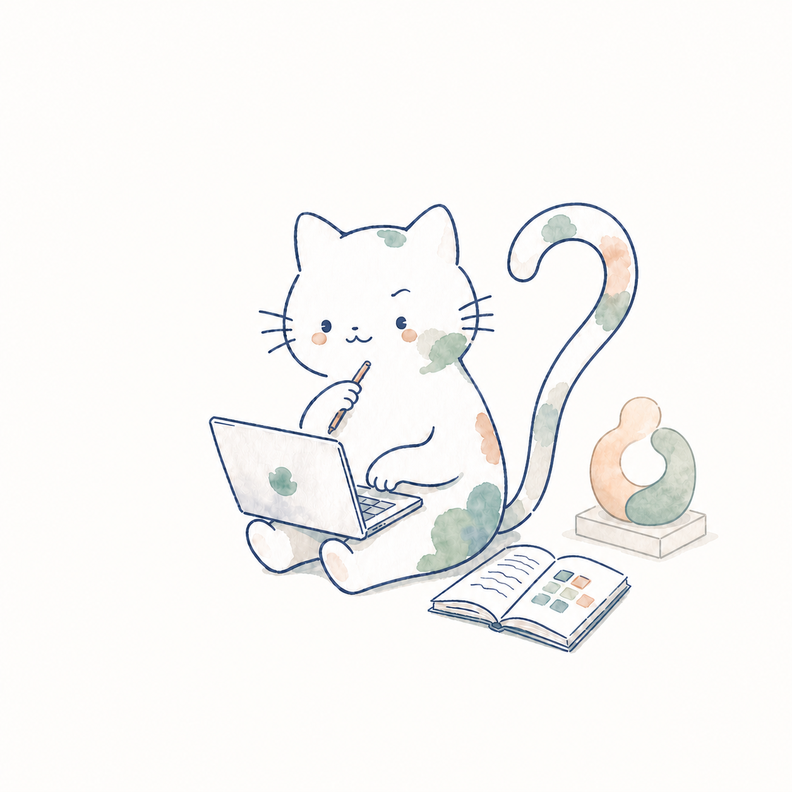
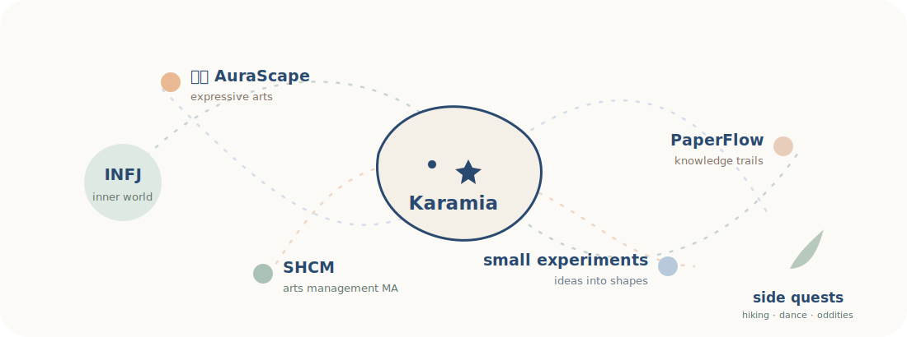

<div align="center">



# Karamia

### 在艺术、研究、疗愈与技术的边缘，做一些温柔、好奇，也有点奇怪的东西。

*Making gentle, curious things at the edges of art, research, healing, and technology.*

`INFJ`　·　`浅境 AuraScape 创始人`　·　`Arts Management @ SHCM`　·　`Curious Maker`

[浅境 AuraScape · 小红书](https://xhslink.com/m/wjGq76dOFR)　　[PaperFlow · 文脉](https://github.com/MuKaramia/PaperFlow)

</div>

<br>



## About this wandering soul

我不太想把自己装进一个单一标签里。

我在上海音乐学院学习艺术管理，是 **浅境 AuraScape** 的创始人，也是一名喜欢观察、联想和不断试验的 INFJ。浅境围绕表达性艺术开展活动与实践，关心创作如何帮助人靠近自己的感受，也关心人与人之间如何在艺术中相遇。

我不是专业开发者。只是有时候，一个问题在脑子里绕得太久，我会忍不住给它做一个可以使用的形状。**PaperFlow｜文脉** 就是这样长出来的：它最初是我整理文献的个人工作流，后来被做成一个可以分享给其他人的开源 Skill。

空闲时，我也喜欢登山。山路会把复杂的问题暂时变得简单：继续走，停下来看看，再决定下一步去哪里。

<br>

## The things I orbit around

| | |
|---|---|
| **浅境 AuraScape**<br><sub>Expressive arts · connection · inner landscapes</sub> | 以表达性艺术为核心的活动与实践。它关心感受如何被看见，经验如何被表达，以及艺术如何成为人与自己、人与他人之间的一处空间。<br><br>[去小红书看看 →](https://xhslink.com/m/wjGq76dOFR) |
| **Arts Management @ SHCM**<br><sub>Culture · value · participation · research</sub> | 在艺术管理的学习中，我关注文化价值、参与、公共性，以及艺术组织如何与真实生活发生关系。研究对我来说不是远离感受，而是换一种方式靠近问题。 |
| **PaperFlow｜文脉**<br><sub>PDF → reading → notes → connected knowledge</sub> | 一套面向 Codex 与 Claude Code 的文献精读工作流。它会保存 PDF 原文，生成独立的译稿、核心解析和精读笔记，再把概念、理论、方法与研究项目连接起来。<br><br>[查看开源项目 →](https://github.com/MuKaramia/PaperFlow) |
| **Small experiments**<br><sub>Ideas · tiny tools · unfinished questions</sub> | 我喜欢做一些不一定属于“本职工作”的小实验。它们可能是一张图、一套活动、一种整理方法，也可能只是一个还没有答案的问号。这里会慢慢留下它们。 |

<br>

## Currently

```text
building    浅境 AuraScape 的表达性艺术活动
refining    PaperFlow｜文脉
studying    Arts Management at SHCM
collecting  山路、颜色、问题，以及偶尔冒出来的小想法
```

<br>

<div align="center">

### A small note

这里不会只有代码，也不会是一份写完就不再变化的简历。

它更像一张持续生长的地图，记录我正在靠近什么、做出什么，以及还有哪些问题没有答案。

`stay curious · stay tender · keep wandering`

</div>
